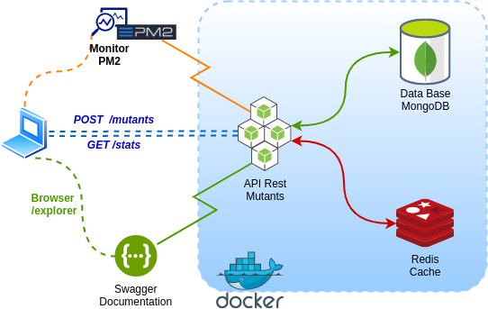

# API Rest Mutants

### Descripcion:
API Rest de mutantes que valida el ADN de los humanos.

## Alcance:
- Validar si el ADN de un humano es de Mutante.
- Ver estadistica de los ADN validados.

## RUN Local:
1- Clonar el repositorio en su maquina
```
git clone git@github.com:rodosj89/mutants.git
```

2- Ubicarse en el directorio del proyecto
```
cd mutants
```

3- Levantar el servicio
```
docker-compose up -d
```

## Swagger
Para visualizar la documentacion de la API Rest Mutants pueden acceder desde el navegador:
&nbsp;
 http://localhost:3000/explorer

## Infrastructura


## Dependencia
- Tener Docker Compose instalado. https://docs.docker.com/compose/install/


&nbsp;
## Develop
[Ariel Ruiz Pardo | https://www.linkedin.com/in/rodolfo-ariel-ruiz-pardo/]
&nbsp;


[-@2x.png)](http://loopback.io/)
